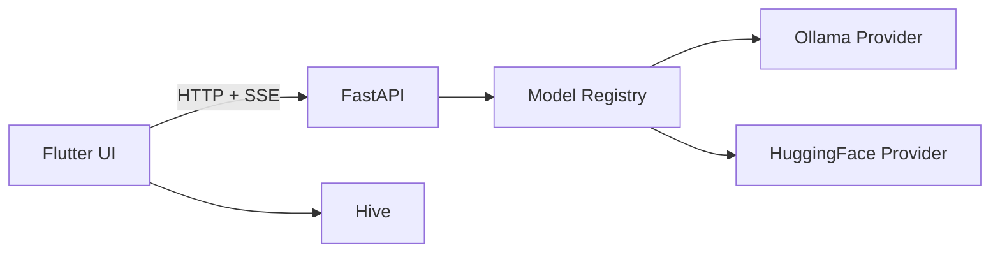

# Architecture

This document describes the current runtime architecture and major components.

## Components

### Flutter Client
- UI screens (chat, auth, settings)
- State management: GetX controllers
- Local storage: Hive (conversations + preferences)
- Networking: REST + SSE streaming

### FastAPI Backend
- `/chat` and `/chat/stream` share a single request schema
- Model routing via a registry and provider interface
- Providers: Ollama and Hugging Face Transformers
- Optional Appwrite logging (if configured)

### Model Layer
- Provider interface for pluggable backends
- Ollama (local inference)
- Hugging Face Transformers (GPU/CPU, optional 4-bit)

## Data Flow

## Key Design Decisions

- Single chat schema for streaming and non-streaming
- Provider abstraction to switch models without client changes
- Local persistence for conversation history
